```mermaid
sequenceDiagram
    participant Server as Uvicorn Server
    participant LifespanTask as Lifespan Task
    participant AppTask as Application Task
    participant UserApp as User Application

    Note over Server: ✅ Server starts

    Server->>+LifespanTask: spawn_task(lifespan_handler)

    LifespanTask->>UserApp: {"type": "lifespan.startup"}

    Note over UserApp: Initialize databases, caches, etc.

    UserApp-->>LifespanTask: {"type": "lifespan.startup.complete"}
    LifespanTask->>Server: ✅ Startup complete

    Server->>+AppTask: spawn_task(application_handler)
    Note over AppTask: ✅ Ready for requests

    rect rgb(240, 248, 255)
        Note over LifespanTask, AppTask: Both tasks running concurrently

        par Lifespan maintains state
            LifespanTask->>LifespanTask: Keep lifespan connection alive
        and Application serves requests
            AppTask->>UserApp: HTTP/WebSocket requests
            UserApp-->>AppTask: Responses
        end
    end

    Note over Server: Shutdown signal received

    Server->>AppTask: Stop accepting new connections
    AppTask->>AppTask: Complete pending requests

    LifespanTask->>UserApp: {"type": "lifespan.shutdown"}

    Note over UserApp: Cleanup databases, caches, etc.

    UserApp-->>LifespanTask: {"type": "lifespan.shutdown.complete"}

    LifespanTask->>-Server: Lifespan task complete
    AppTask->>-Server: Application task complete

    Note over Server: ✅ Server stopped
```

================
CODE SNIPPETS
================
TITLE: Install Uvicorn
DESCRIPTION: Installs Uvicorn using pip or the 'uv' package manager. This is the first step to using Uvicorn for running ASGI applications.

SOURCE: https://github.com/encode/uvicorn/blob/master/docs/index.md

LANGUAGE: bash
CODE:
```
pip install uvicorn
```

LANGUAGE: bash
CODE:
```
uv add uvicorn
```

--------------------------------

TITLE: Install Uvicorn (Minimal)
DESCRIPTION: Installs Uvicorn with essential dependencies like h11 and click.

SOURCE: https://github.com/encode/uvicorn/blob/master/docs/installation.md

LANGUAGE: bash
CODE:
```
pip install uvicorn
```

LANGUAGE: bash
CODE:
```
uv add uvicorn
```

--------------------------------

TITLE: Install Project Dependencies
DESCRIPTION: Commands to navigate into the cloned Uvicorn directory and install the project and its dependencies using the provided installation script.

SOURCE: https://github.com/encode/uvicorn/blob/master/docs/contributing.md

LANGUAGE: shell
CODE:
```
$ cd uvicorn
$ scripts/install
```

--------------------------------

TITLE: Install and Run Hypercorn
DESCRIPTION: Installs the Hypercorn ASGI server using pip and shows how to run an ASGI application. Hypercorn supports HTTP/1.1, HTTP/2, HTTP/3, and WebSockets.

SOURCE: https://github.com/encode/uvicorn/blob/master/docs/concepts/asgi.md

LANGUAGE: shell
CODE:
```
pip install hypercorn
hypercorn app:App
```

--------------------------------

TITLE: Serve Uvicorn Documentation Locally
DESCRIPTION: Starts a local server to preview changes to the Uvicorn documentation. Documentation files are located in the `docs/` folder.

SOURCE: https://github.com/encode/uvicorn/blob/master/docs/contributing.md

LANGUAGE: shell
CODE:
```
$ scripts/docs serve
```

--------------------------------

TITLE: Install and Run Daphne
DESCRIPTION: Installs the Daphne ASGI server using pip and demonstrates how to run an ASGI application with it. Daphne is a production-ready ASGI server that supports HTTP/1.1, HTTP/2, and WebSockets.

SOURCE: https://github.com/encode/uvicorn/blob/master/docs/concepts/asgi.md

LANGUAGE: shell
CODE:
```
pip install daphne
daphne app:App
```

--------------------------------

TITLE: Simple ASGI Application
DESCRIPTION: Defines a basic ASGI application that responds with 'Hello, world!' to HTTP requests. This serves as the core application logic.

SOURCE: https://github.com/encode/uvicorn/blob/master/docs/deployment/docker.md

LANGUAGE: python
CODE:
```python
async def app(scope, receive, send):
    body = "Hello, world!"
    await send(
        {
            "type": "http.response.start",
            "status": 200,
            "headers": [
                [b"content-type", b"text/plain"],
                [b"content-length", len(body)],
            ],
        }
    )
    await send(
        {
            "type": "http.response.body",
            "body": body.encode("utf-8"),
        }
    )
```

--------------------------------

TITLE: Run Uvicorn Server
DESCRIPTION: Starts the Uvicorn server to host the specified ASGI application. The command assumes the application is defined in a file named 'example.py' and is named 'app'.

SOURCE: https://github.com/encode/uvicorn/blob/master/README.md

LANGUAGE: shell
CODE:
```bash
uvicorn example:app
```

--------------------------------

TITLE: Uvicorn Application Factory Example
DESCRIPTION: Demonstrates how to define an application factory function in Python and run it with Uvicorn using the --factory flag.

SOURCE: https://github.com/encode/uvicorn/blob/master/docs/index.md

LANGUAGE: python
CODE:
```python
def create_app():
    app = ...
    return app
```

LANGUAGE: shell
CODE:
```bash
uvicorn --factory main:create_app
```

--------------------------------

TITLE: Install Uvicorn (Standard Extra)
DESCRIPTION: Installs Uvicorn with all optional dependencies for features like uvloop, httptools, websockets, watchfiles, colorama, python-dotenv, and PyYAML.

SOURCE: https://github.com/encode/uvicorn/blob/master/docs/installation.md

LANGUAGE: bash
CODE:
```bash
pip install 'uvicorn[standard]'
```

LANGUAGE: bash
CODE:
```bash
uv add 'uvicorn[standard]'
```

--------------------------------

TITLE: Install Uvicorn
DESCRIPTION: Installs Uvicorn with minimal dependencies or with optional extras like uvloop and httptools for improved performance. The '[standard]' option includes features for development mode and broader compatibility.

SOURCE: https://github.com/encode/uvicorn/blob/master/README.md

LANGUAGE: shell
CODE:
```bash
pip install uvicorn
pip install 'uvicorn[standard]'
```

--------------------------------

TITLE: Cache-Aware Dockerfile for Uvicorn Application
DESCRIPTION: A Dockerfile optimized for Python applications using Uvicorn and uv. It leverages Docker's build cache by installing dependencies before copying project files, significantly speeding up rebuilds. It also includes instructions for running the application with Uvicorn.

SOURCE: https://github.com/encode/uvicorn/blob/master/docs/deployment/docker.md

LANGUAGE: dockerfile
CODE:
```dockerfile
FROM python:3.12-slim
COPY --from=ghcr.io/astral-sh/uv:latest /uv /uvx /bin/

# Change the working directory to the `app` directory
WORKDIR /app

# Install dependencies
RUN --mount=type=cache,target=/root/.cache/uv \
    --mount=type=bind,source=uv.lock,target=uv.lock \
    --mount=type=bind,source=pyproject.toml,target=pyproject.toml \
    uv sync --frozen --no-install-project

# Copy the project into the image
ADD . /app

# Sync the project
RUN --mount=type=cache,target=/root/.cache/uv \
    uv sync --frozen

# Run with uvicorn
CMD ["uv", "run", "uvicorn", "main:app", "--host", "0.0.0.0", "--port", "8000"]
```

--------------------------------

TITLE: Run Uvicorn from Command Line
DESCRIPTION: Executes the Uvicorn server using the command line interface. This command starts the server and serves the specified ASGI application.

SOURCE: https://github.com/encode/uvicorn/blob/master/docs/index.md

LANGUAGE: bash
CODE:
```bash
uvicorn main:app
```

--------------------------------

TITLE: Docker Build and Run Commands
DESCRIPTION: Commands to build the Docker image from the Dockerfile and run the container. This allows for testing the application in a containerized environment.

SOURCE: https://github.com/encode/uvicorn/blob/master/docs/deployment/docker.md

LANGUAGE: bash
CODE:
```bash
docker build -t my-app .

```

LANGUAGE: bash
CODE:
```bash
docker run -p 8000:8000 my-app

```

--------------------------------

TITLE: Project Initialization and Dependency Management
DESCRIPTION: Commands to initialize a new Python project using 'uv' and add 'uvicorn' as a dependency. This sets up the project structure and ensures Uvicorn is available.

SOURCE: https://github.com/encode/uvicorn/blob/master/docs/deployment/docker.md

LANGUAGE: bash
CODE:
```bash
uv init app

```

LANGUAGE: bash
CODE:
```bash
uv add uvicorn

```

LANGUAGE: bash
CODE:
```bash
uv run uvicorn main:app

```

--------------------------------

TITLE: Run Uvicorn from an Async Environment with Server.serve
DESCRIPTION: Starts the Uvicorn server from an existing asynchronous environment using `uvicorn.Server.serve`. This is useful when Uvicorn needs to be integrated into an already running async application or event loop.

SOURCE: https://github.com/encode/uvicorn/blob/master/docs/index.md

LANGUAGE: python
CODE:
```python
import asyncio
import uvicorn

async def app(scope, receive, send):
    ...

async def main():
    config = uvicorn.Config("main:app", port=5000, log_level="info")
    server = uvicorn.Server(config)
    await server.serve()

if __name__ == "__main__":
    asyncio.run(main())
```

--------------------------------

TITLE: Instance-Based ASGI Application
DESCRIPTION: An example of an ASGI application implemented as a class with an asynchronous __call__ method. This pattern allows for stateful applications.

SOURCE: https://github.com/encode/uvicorn/blob/master/docs/concepts/asgi.md

LANGUAGE: python
CODE:
```python
class App:
    async def __call__(self, scope, receive, send):
        assert scope['type'] == 'http'
        ...

app = App()
```

--------------------------------

TITLE: Run Uvicorn Programmatically with Config and Server
DESCRIPTION: Provides more control over Uvicorn's configuration and server lifecycle by using `uvicorn.Config` and `uvicorn.Server`. This approach allows for detailed customization before starting the server.

SOURCE: https://github.com/encode/uvicorn/blob/master/docs/index.md

LANGUAGE: python
CODE:
```python
import uvicorn

async def app(scope, receive, send):
    ...

if __name__ == "__main__":
    config = uvicorn.Config("main:app", port=5000, log_level="info")
    server = uvicorn.Server(config)
    server.run()
```

--------------------------------

TITLE: Alternative ASGI Servers
DESCRIPTION: Demonstrates how to install and run alternative ASGI servers like Daphne and Hypercorn. These servers offer different features and support various async frameworks.

SOURCE: https://github.com/encode/uvicorn/blob/master/README.md

LANGUAGE: shell
CODE:
```bash
pip install daphne
daphne app:App
```

LANGUAGE: shell
CODE:
```bash
pip install hypercorn
hypercorn app:App
```

--------------------------------

TITLE: HTTP Scope Example
DESCRIPTION: Illustrates the structure of the 'scope' dictionary for an incoming HTTP request. It includes details like the request method, path, headers, and server information.

SOURCE: https://github.com/encode/uvicorn/blob/master/docs/concepts/asgi.md

LANGUAGE: python
CODE:
```python
{
    'type': 'http',
    'scheme': 'http',
    'root_path': '',
    'server': ('127.0.0.1', 8000),
    'http_version': '1.1',
    'method': 'GET',
    'path': '/',
    'headers': [
        (b'host', b'127.0.0.1:8000'),
        (b'user-agent', b'curl/7.51.0'),
        (b'accept', b'*/*')
    ]
}
```

--------------------------------

TITLE: ASGI Application: Echo Method and Path
DESCRIPTION: A practical example of an ASGI application that echoes the HTTP request's method and path back to the client in the response body.

SOURCE: https://github.com/encode/uvicorn/blob/master/docs/concepts/asgi.md

LANGUAGE: python
CODE:
```python
async def app(scope, receive, send):
    """
    Echo the method and path back in an HTTP response.
    """
    assert scope['type'] == 'http'

    body = f'Received {scope["method"]} request to {scope["path"]}'
    await send({
        'type': 'http.response.start',
        'status': 200,
        'headers': [
            [b'content-type', b'text/plain'],
        ]
    })
    await send({
        'type': 'http.response.body',
        'body': body.encode('utf-8'),
    })
```

--------------------------------

TITLE: Uvicorn Explicit Optional Dependencies
DESCRIPTION: Lists optional dependencies that can be installed for extended features or compatibility.

SOURCE: https://github.com/encode/uvicorn/blob/master/requirements.txt

LANGUAGE: python
CODE:
```python
a2wsgi==1.10.8
wsproto==1.2.0
websockets==13.1
```

--------------------------------

TITLE: Run Uvicorn Programmatically with uvicorn.run
DESCRIPTION: Runs the Uvicorn server programmatically using the `uvicorn.run` function. This is a convenient way to start the server directly from your Python application, specifying the application and server options.

SOURCE: https://github.com/encode/uvicorn/blob/master/docs/index.md

LANGUAGE: python
CODE:
```python
import uvicorn

async def app(scope, receive, send):
    ...

if __name__ == "__main__":
    uvicorn.run("main:app", port=5000, log_level="info")
```

--------------------------------

TITLE: Function-Based ASGI Application
DESCRIPTION: An example of a basic ASGI application implemented as an asynchronous function. It asserts the connection type is 'http' and outlines where application logic would reside.

SOURCE: https://github.com/encode/uvicorn/blob/master/docs/concepts/asgi.md

LANGUAGE: python
CODE:
```python
async def app(scope, receive, send):
    assert scope['type'] == 'http'
    ...
```

--------------------------------

TITLE: Gunicorn Integration with Uvicorn
DESCRIPTION: Demonstrates how to run Uvicorn in production using Gunicorn as a process manager. It includes examples for using the default Uvicorn worker and the UvicornH11 worker for PyPy compatibility, and shows how to subclass UvicornWorker to pass custom configuration.

SOURCE: https://github.com/encode/uvicorn/blob/master/docs/deployment/index.md

LANGUAGE: bash
CODE:
```bash
gunicorn -w 4 -k uvicorn.workers.UvicornWorker
```

LANGUAGE: bash
CODE:
```bash
gunicorn -w 4 -k uvicorn.workers.UvicornH11Worker
```

--------------------------------

TITLE: Custom Gunicorn Uvicorn Worker
DESCRIPTION: Provides an example of subclassing `UvicornWorker` to customize the configuration passed to Uvicorn workers when running under Gunicorn.

SOURCE: https://github.com/encode/uvicorn/blob/master/docs/deployment/index.md

LANGUAGE: python
CODE:
```python
from uvicorn.workers import UvicornWorker

class MyUvicornWorker(UvicornWorker):
    CONFIG_KWARGS = {"loop": "asyncio", "http": "h11", "lifespan": "off"}
```

--------------------------------

TITLE: Uvicorn Multi-Process Execution
DESCRIPTION: Shows how to run multiple Uvicorn worker processes using the built-in `--workers` option for improved performance and resilience. It also mentions the 'spawn' start method used by Uvicorn's multiprocessing manager.

SOURCE: https://github.com/encode/uvicorn/blob/master/docs/deployment/index.md

LANGUAGE: bash
CODE:
```bash
uvicorn main:app --workers 4
```

--------------------------------

TITLE: Sending HTTP Response Start Message
DESCRIPTION: Demonstrates how an ASGI application sends the initial response message to the server using the 'send' coroutine. This includes the HTTP status code and response headers.

SOURCE: https://github.com/encode/uvicorn/blob/master/docs/concepts/asgi.md

LANGUAGE: python
CODE:
```python
await send({
    'type': 'http.response.start',
    'status': 200,
    'headers': [
        [b'content-type', b'text/plain'],
    ]
})
```

--------------------------------

TITLE: Running Gunicorn with Uvicorn Worker and HTTPS
DESCRIPTION: Example of running Uvicorn as a worker for Gunicorn with SSL/TLS enabled. This combines the process management capabilities of Gunicorn with Uvicorn's ASGI server.

SOURCE: https://github.com/encode/uvicorn/blob/master/docs/deployment/index.md

LANGUAGE: bash
CODE:
```bash
gunicorn --keyfile=./key.pem --certfile=./cert.pem -k uvicorn.workers.UvicornWorker main:app
```

--------------------------------

TITLE: Docker Compose for Development Hot-Reloading
DESCRIPTION: A docker-compose.yml file to set up a development environment for the Uvicorn application. It enables hot-reloading by mounting the current directory as a volume and setting the UVICORN_RELOAD environment variable.

SOURCE: https://github.com/encode/uvicorn/blob/master/docs/deployment/docker.md

LANGUAGE: yaml
CODE:
```yaml
services:
  backend:
    build: .
    ports:
      - "8000:8000"
    environment:
      - UVICORN_RELOAD=true
    volumes:
      - .:/app
    tty: true

```

--------------------------------

TITLE: Uvicorn Graceful Process Shutdown
DESCRIPTION: Details Uvicorn's strategy for graceful process shutdowns, including starting new processes, stopping old ones, closing connections, and completing background tasks within timeouts.

SOURCE: https://github.com/encode/uvicorn/blob/master/docs/server-behavior.md

LANGUAGE: text
CODE:
```text
Graceful process shutdowns are particularly important during a restart period. During this period you want to:

* Start a number of new server processes to handle incoming requests, listening on the existing socket.
* Stop the previous server processes from listening on the existing socket.
* Close any connections that are not currently waiting on an HTTP response, and wait for any other connections to finalize their HTTP responses.
* Wait for any background tasks to run to completion, such as occurs when the ASGI application has sent the HTTP response, but the asyncio task has not yet run to completion.

Uvicorn handles process shutdown gracefully, ensuring that connections are properly finalized, and all tasks have run to completion. During a shutdown period Uvicorn will ensure that responses and tasks must still complete within the configured timeout periods.
```

--------------------------------

TITLE: Nginx Configuration for Uvicorn Proxy
DESCRIPTION: An Nginx configuration to proxy requests to Uvicorn. It includes settings for handling host headers, forwarded headers, websockets, and uses a UNIX domain socket for communication. This setup enhances resilience and offloads tasks like static file serving.

SOURCE: https://github.com/encode/uvicorn/blob/master/docs/deployment/index.md

LANGUAGE: conf
CODE:
```conf
http {
  server {
    listen 80;
    client_max_body_size 4G;

    server_name example.com;

    location / {
      proxy_set_header Host $http_host;
      proxy_set_header X-Forwarded-For $proxy_add_x_forwarded_for;
      proxy_set_header X-Forwarded-Proto $scheme;
      proxy_set_header Upgrade $http_upgrade;
      proxy_set_header Connection $connection_upgrade;
      proxy_redirect off;
      proxy_buffering off;
      proxy_pass http://uvicorn;
    }

    location /static {
      # path for static files
      root /path/to/app/static;
    }
  }

  map $http_upgrade $connection_upgrade {
    default upgrade;
    '' close;
  }

  upstream uvicorn {
    server unix:/tmp/uvicorn.sock;
  }

}
```

--------------------------------

TITLE: Uvicorn Command-Line Execution
DESCRIPTION: Demonstrates how to run the Uvicorn server from the command line, including options for auto-reloading and specifying the application path. It also shows how to access help for all available options.

SOURCE: https://github.com/encode/uvicorn/blob/master/docs/deployment/index.md

LANGUAGE: bash
CODE:
```bash
uvicorn main:app --reload --port 5000
```

LANGUAGE: bash
CODE:
```bash
uvicorn --help
```

--------------------------------

TITLE: Basic ASGI Application
DESCRIPTION: A simple ASGI application that responds with 'Hello, world!' to HTTP requests. It demonstrates the basic structure of an ASGI application, including handling the 'http.response.start' and 'http.response.body' events.

SOURCE: https://github.com/encode/uvicorn/blob/master/README.md

LANGUAGE: python
CODE:
```python
async def app(scope, receive, send):
    assert scope['type'] == 'http'

    await send({
        'type': 'http.response.start',
        'status': 200,
        'headers': [
            (b'content-type', b'text/plain'),
        ],
    })
    await send({
        'type': 'http.response.body',
        'body': b'Hello, world!',
    })
```

--------------------------------

TITLE: Uvicorn Command Line Configuration
DESCRIPTION: Demonstrates how to configure Uvicorn using command-line arguments for host and port.

SOURCE: https://github.com/encode/uvicorn/blob/master/docs/settings.md

LANGUAGE: bash
CODE:
```bash
uvicorn main:app --host 0.0.0.0 --port 8000
```

--------------------------------

TITLE: Simple ASGI Application
DESCRIPTION: A basic ASGI application that responds with 'Hello, world!' to HTTP requests. It demonstrates the structure of an ASGI application, including handling scope, receive, and send.

SOURCE: https://github.com/encode/uvicorn/blob/master/docs/index.md

LANGUAGE: python
CODE:
```python
async def app(scope, receive, send):
    assert scope['type'] == 'http'

    await send({
        'type': 'http.response.start',
        'status': 200,
        'headers': [
            (b'content-type', b'text/plain'),
            (b'content-length', b'13'),
        ],
    })
    await send({
        'type': 'http.response.body',
        'body': b'Hello, world!',
    })
```

--------------------------------

TITLE: Run Uvicorn with Gunicorn
DESCRIPTION: Demonstrates how to run an ASGI application using Gunicorn with Uvicorn's worker class. This combines Gunicorn's process management capabilities with Uvicorn's performance for production deployments.

SOURCE: https://github.com/encode/uvicorn/blob/master/docs/index.md

LANGUAGE: bash
CODE:
```bash
gunicorn example:app -w 4 -k uvicorn.workers.UvicornWorker
```

--------------------------------

TITLE: Uvicorn Configuration Options
DESCRIPTION: Comprehensive list of Uvicorn configuration options covering application, socket binding, development, and production settings.

SOURCE: https://github.com/encode/uvicorn/blob/master/docs/settings.md

LANGUAGE: APIDOC
CODE:
```
APP - The ASGI application to run, in the format "<module>:<attribute>".
--factory - Treat APP as an application factory, i.e. a `() -> <ASGI app>` callable.
--app-dir <path> - Look for APP in the specified directory by adding it to the PYTHONPATH. Default: Current working directory.

--host <str> - Bind socket to this host. Use `--host 0.0.0.0` to make the application available on your local network. IPv6 addresses are supported, for example: `--host '::'`. Default: '127.0.0.1'.
--port <int> - Bind to a socket with this port. If set to 0, an available port will be picked. Default: 8000.
--uds <path> - Bind to a UNIX domain socket, for example `--uds /tmp/uvicorn.sock`. Useful if you want to run Uvicorn behind a reverse proxy.
--fd <int> - Bind to socket from this file descriptor. Useful if you want to run Uvicorn within a process manager.

--reload - Enable auto-reload. Default: False.
--reload-dir <path> - Specify which directories to watch for python file changes. May be used multiple times. If unused, then by default the whole current directory will be watched. If you are running programmatically use `reload_dirs=[]` and pass a list of strings.
--reload-delay <float> - Delay between previous and next check if application needs to be reloaded. Default: 0.25.
--reload-include <glob-pattern> - Specify a glob pattern to match files or directories which will be watched. May be used multiple times. By default the following patterns are included: `*.py`.
--reload-exclude <glob-pattern> - Specify a glob pattern to match files or directories which will excluded from watching. May be used multiple times. By default the following patterns are excluded: `.*, .py[cod], .sw.*, ~*`.

--workers <int> - Number of worker processes. Defaults to the `$WEB_CONCURRENCY` environment variable if available, or 1. Not valid with `--reload`. 
--env-file <path> - Environment configuration file for the ASGI application. Default: None.
```

--------------------------------

TITLE: Uvicorn Programmatic Configuration
DESCRIPTION: Shows how to configure Uvicorn programmatically using keyword arguments in `uvicorn.run()`.

SOURCE: https://github.com/encode/uvicorn/blob/master/docs/settings.md

LANGUAGE: python
CODE:
```python
uvicorn.run("main:app", host="0.0.0.0", port=8000)
```

--------------------------------

TITLE: Uvicorn Release Process
DESCRIPTION: This section outlines the steps for Uvicorn maintainers to release a new version. It includes updating the changelog according to Keep a Changelog standards, bumping the version in `__init__.py`, and creating a new release on GitHub, which automatically publishes to PyPI.

SOURCE: https://github.com/encode/uvicorn/blob/master/docs/contributing.md

LANGUAGE: markdown
CODE:
```markdown
## Releasing

*This section is targeted at Uvicorn maintainers.*

Before releasing a new version, create a pull request that includes:

- **An update to the changelog**:
    - We follow the format from [keepachangelog](https://keepachangelog.com/en/1.0.0/).
    - [Compare](https://github.com/encode/uvicorn/compare/) `master` with the tag of the latest release, and list all entries that are of interest to our users:
        - Things that **must** go in the changelog: added, changed, deprecated or removed features, and bug fixes.
        - Things that **should not** go in the changelog: changes to documentation, tests or tooling.
        - Try sorting entries in descending order of impact / importance.
        - Keep it concise and to-the-point. 🎯
- **A version bump**: see `__init__.py`.

For an example, see [#1006](https://github.com/encode/uvicorn/pull/1107).

Once the release PR is merged, create a
[new release](https://github.com/encode/uvicorn/releases/new) including:

- Tag version like `0.13.3`.
- Release title `Version 0.13.3`
- Description copied from the changelog.

Once created this release will be automatically uploaded to PyPI.

If something goes wrong with the PyPI job the release can be published using the
`scripts/publish` script.
```

--------------------------------

TITLE: Uvicorn Environment Variable Configuration
DESCRIPTION: Illustrates setting Uvicorn configuration via environment variables with the `UVICORN_` prefix.

SOURCE: https://github.com/encode/uvicorn/blob/master/docs/settings.md

LANGUAGE: bash
CODE:
```bash
export UVICORN_HOST="0.0.0.0"
export UVICORN_PORT="8000"
uvicorn main:app
```

--------------------------------

TITLE: Supervisor Configuration for Uvicorn
DESCRIPTION: A basic supervisor configuration file to manage Uvicorn processes. It specifies the command to run, the number of processes, and logging settings. The socket is handed over to uvicorn using its file descriptor.

SOURCE: https://github.com/encode/uvicorn/blob/master/docs/deployment/index.md

LANGUAGE: ini
CODE:
```ini
[supervisord]

[fcgi-program:uvicorn]
socket=tcp://localhost:8000
command=venv/bin/uvicorn --fd 0 main:App
numprocs=4
process_name=uvicorn-%(process_num)d
stdout_logfile=/dev/stdout
stdout_logfile_maxbytes=0
```

--------------------------------

TITLE: ASGI Application with Lifespan Protocol
DESCRIPTION: A minimal ASGI application demonstrating the implementation of the lifespan protocol for startup and shutdown events. It handles 'lifespan.startup' and 'lifespan.shutdown' messages, printing messages to the console during these phases. It also handles basic HTTP requests.

SOURCE: https://github.com/encode/uvicorn/blob/master/docs/concepts/lifespan.md

LANGUAGE: python
CODE:
```python
async def app(scope, receive, send):
    if scope['type'] == 'lifespan':
        while True:
            message = await receive()
            if message['type'] == 'lifespan.startup':
                print("Application is starting up...")
                await send({'type': 'lifespan.startup.complete'})
            elif message['type'] == 'lifespan.shutdown':
                print("Application is shutting down...")
                await send({'type': 'lifespan.shutdown.complete'})
                return
    elif scope['type'] == 'http':
        await send({
            'type': 'http.response.start',
            'status': 200,
            'headers': [(b'content-type', b'text/plain')],
        })
        await send({'type': 'http.response.body', 'body': b'Hello, World!'})
    else:
        raise RuntimeError("This server doesn't support WebSocket.")
```

--------------------------------

TITLE: Clone Uvicorn Repository
DESCRIPTION: Instructions to clone the Uvicorn repository from GitHub to your local machine. Replace 'YOUR-USERNAME' with your actual GitHub username.

SOURCE: https://github.com/encode/uvicorn/blob/master/docs/contributing.md

LANGUAGE: shell
CODE:
```bash
$ git clone https://github.com/YOUR-USERNAME/uvicorn
```

--------------------------------

TITLE: Uvicorn HTTP Pipelining Support
DESCRIPTION: Explains Uvicorn's pragmatic approach to HTTP pipelining, where requests are queued and processed sequentially after responses are handled, acknowledging potential implementation issues.

SOURCE: https://github.com/encode/uvicorn/blob/master/docs/server-behavior.md

LANGUAGE: text
CODE:
```text
HTTP/1.1 provides support for sending multiple requests on a single connection, before having received each corresponding response. Servers are required to support HTTP pipelining, but it is now generally accepted to lead to implementation issues. It is not enabled on browsers, and may not necessarily be enabled on any proxies that the HTTP request passes through.

Uvicorn supports pipelining pragmatically. It will queue up any pipelined HTTP requests, and pause reading from the underlying transport. It will not start processing pipelined requests until each response has been dealt with in turn.
```

--------------------------------

TITLE: Running Uvicorn with HTTPS
DESCRIPTION: Command to run Uvicorn with SSL/TLS enabled, requiring certificate and key files. This is essential for secure communication over HTTPS.

SOURCE: https://github.com/encode/uvicorn/blob/master/docs/deployment/index.md

LANGUAGE: bash
CODE:
```bash
uvicorn main:app --port 5000 --ssl-keyfile=./key.pem --ssl-certfile=./cert.pem
```

--------------------------------

TITLE: Uvicorn Configuration and Runtime Changes
DESCRIPTION: This section details changes related to Uvicorn's configuration parameters and runtime behavior, including graceful shutdown timeouts, signal handling on Windows, and the behavior of the reload functionality.

SOURCE: https://github.com/encode/uvicorn/blob/master/docs/release-notes.md

LANGUAGE: python
CODE:
```python
Add `--timeout-graceful-shutdown` parameter (#1950)
Handle `SIGBREAK` on Windows (#1909)
Shutdown event is now being triggered on Windows when using hot reload (#1584)
`--reload-delay` is effectively used on the `watchfiles` reloader (#1930)
Reset lifespan state on each request (#1903)
Avoid importing `h11` and `pyyaml` when not needed to improve import time (#1846)
Replace current native `WSGIMiddleware` implementation by `a2wsgi` (#1825)
Change default `--app-dir` from "." (dot) to "" (empty string) (#1835)
Send code 1012 on shutdown for WebSockets (#1816)
Use `surrogateescape` to encode headers on `websockets` implementation (#1005)
Fix warning message on reload failure (#1784)
Check if handshake is completed before sending frame on `wsproto` shutdown (#1737)
Add default headers to WebSockets implementations (#1606 & #1747)
Warn user when `reload` and `workers` flag are used together (#1731)
Use correct `WebSocket` error codes on `close` (#1753)
Send disconnect event on connection lost for `wsproto` (#996)
Add `SIGQUIT` handler to `UvicornWorker` (#1710)
Fix crash on exist with "--uds" if socket doesn't exist (#1725)
Annotate `CONFIG_KWARGS` in `UvicornWorker` class (#1746)
Remove conditional on `RemoteProtocolError.event_hint` on `wsproto` (#1486)
Remove unused `handle_no_connect` on `wsproto` implementation (#1759)
Support Python 3.11 (#1652)
Bump minimal `httptools` version to `0.5.0` (#1645)
Ignore HTTP/2 upgrade and optionally ignore WebSocket upgrade (#1661)
Add `py.typed` to comply with PEP 561 (#1687)
Set `propagate` to `False` on "uvicorn" logger (#1288)
USR1 signal is now handled correctly on `UvicornWorker`. (#1565)
Use path with query string on `WebSockets` logs (#1385)
Fix behavior on which "Date" headers were not updated on the same connection (#1706)
Remove the `--debug` flag (#1640)
Remove the `DebugMiddleware` (#1697)
Remove cyclic references on HTTP implementations. (#1604)
`reload_delay` default changed from `None` to `0.25` on `uvicorn.run()` and `Config`. `None` is not an acceptable value anymore. (#1545)
Add default `log_config` on `uvicorn.run()` (#1541)
Revert `logging` file name modification (#1543)
Use `DEFAULT_MAX_INCOMPLETE_EVENT_SIZE` as default to `h11_max_incomplete_event_size` on the CLI (#1534)
The `reload` flag prioritizes `watchfiles` instead of the deprecated `watchgod` (#1437)
Annotate `uvicorn.run()` function (#1423)
Allow configuring `max_incomplete_event_size` for `h11` implementation (#1514)
Remove `asgiref` dependency (#1532)
Turn `raw_path` into bytes on both websockets implementations (#1487)
Revert log exception traceback in case of invalid HTTP request (#1518)
Set `asyncio.WindowsSelectorEventLoopPolicy()` when using multiple workers to avoid "WinError 87" (#1454)
Change `httptools` range to `>=0.4.0` (#1400)
Fix case where url is fragmented in httptools protocol (#1263)
Fix WSGI middleware not to explode quadratically in the case of a larger body (#1329)
Send HTTP 400 response for invalid request (#1352)
Replace `create_server` by `create_unix_server` (#1362)
Drop wsproto version checking. (#1359)
Revert #1332. While trying to solve the memory leak, it introduced an issue (#1345) when the server receives big chunks of data using the `httptools` implementation. (#1354)
Revert stream interface changes. This was introduced on 0.14.0, and caused an issue (#1226), which caused a memory leak when sending TCP pings. (#1355)
Fix wsproto version check expression (#1342)
```

--------------------------------

TITLE: Uvicorn Testing Dependencies
DESCRIPTION: Lists the dependencies used for testing the Uvicorn project, including linters, test runners, and coverage tools.

SOURCE: https://github.com/encode/uvicorn/blob/master/requirements.txt

LANGUAGE: python
CODE:
```python
ruff==0.11.9
pytest==8.3.5
pytest-mock==3.14.0
pytest-xdist[psutil]==3.6.1
mypy==1.15.0
types-click==7.1.8
types-pyyaml==6.0.12.20250402
trustme==1.2.1
cryptography==44.0.3
coverage==7.8.0
coverage-conditional-plugin==0.9.0
coverage-enable-subprocess==1.0
httpx==0.28.1
```

--------------------------------

TITLE: Run Uvicorn Tests
DESCRIPTION: Executes the test suite for Uvicorn. Additional arguments can be passed to pytest for more specific testing, such as running a single test file.

SOURCE: https://github.com/encode/uvicorn/blob/master/docs/contributing.md

LANGUAGE: shell
CODE:
```bash
$ scripts/test
$ scripts/test tests/test_cli.py
```

--------------------------------

TITLE: Uvicorn Documentation Dependencies
DESCRIPTION: Specifies the dependencies required for building and generating the project's documentation.

SOURCE: https://github.com/encode/uvicorn/blob/master/requirements.txt

LANGUAGE: python
CODE:
```python
mkdocs==1.6.1
mkdocs-material==9.6.13
mkdocstrings-python==1.16.12
mkdocs-llmstxt==0.2.0
```

--------------------------------

TITLE: Uvicorn Worker and Signal Handling
DESCRIPTION: This section details changes related to Uvicorn's worker processes and signal handling, including handling SIGBREAK on Windows, adding SIGQUIT handlers, and correctly handling USR1 signals.

SOURCE: https://github.com/encode/uvicorn/blob/master/docs/release-notes.md

LANGUAGE: python
CODE:
```python
Handle `SIGBREAK` on Windows (#1909)
Add `SIGQUIT` handler to `UvicornWorker` (#1710)
Annotate `CONFIG_KWARGS` in `UvicornWorker` class (#1746)
USR1 signal is now handled correctly on `UvicornWorker`. (#1565)
Set `asyncio.WindowsSelectorEventLoopPolicy()` when using multiple workers to avoid "WinError 87" (#1454)
```

--------------------------------

TITLE: Uvicorn Packaging Dependencies
DESCRIPTION: Includes dependencies necessary for packaging and distributing the Uvicorn project.

SOURCE: https://github.com/encode/uvicorn/blob/master/requirements.txt

LANGUAGE: python
CODE:
```python
build==1.2.2.post1
twine==6.1.0
```

--------------------------------

TITLE: Uvicorn Lifespan Architecture Diagram
DESCRIPTION: A Mermaid sequence diagram illustrating the Uvicorn lifespan architecture. It shows the interaction between the Uvicorn Server, Lifespan Task, Application Task, and the User Application during startup, concurrent operation, and shutdown phases.

SOURCE: https://github.com/encode/uvicorn/blob/master/docs/concepts/lifespan.md

LANGUAGE: mermaid
CODE:


--------------------------------

TITLE: Request and Response Body Handling
DESCRIPTION: Covers response completion, `Expect: 100-Continue` header handling, and `HEAD` request processing.

SOURCE: https://github.com/encode/uvicorn/blob/master/docs/server-behavior.md

LANGUAGE: APIDOC
CODE:
```
Response Completion:
  - Uvicorn stops buffering request body after response is sent.
  - Subsequent `receive` calls return `http.disconnect`.

Expect: 100-Continue:
  - Uvicorn sends `100 Continue` confirmation only if ASGI app calls `receive` to read request body.
  - Proxy configurations might not forward this header.

HEAD Requests:
  - Uvicorn strips response body for `HEAD` requests.
  - Applications should treat `HEAD` like `GET` for consistent headers.
```

--------------------------------

TITLE: ASGI Application: Streaming Response
DESCRIPTION: Demonstrates how to create a streaming HTTP response by sending multiple 'http.response.body' messages. This is useful for large responses or real-time data.

SOURCE: https://github.com/encode/uvicorn/blob/master/docs/concepts/asgi.md

LANGUAGE: python
CODE:
```python
import asyncio


async def app(scope, receive, send):
    """
    Send a slowly streaming HTTP response back to the client.
    """
    await send({
        'type': 'http.response.start',
        'status': 200,
        'headers': [
            [b'content-type', b'text/plain'],
        ]
    })
    for chunk in [b'Hello', b', ', b'world!']:
        await send({
            'type': 'http.response.body',
            'body': chunk,
            'more_body': True
        })
        await asyncio.sleep(1)
    await send({
        'type': 'http.response.body',
        'body': b'',
    })
```

--------------------------------

TITLE: Community Contributors List
DESCRIPTION: This markdown section lists key contributors to the Starlette and Uvicorn projects, including their GitHub handles and a brief mention of their contributions. It also provides links to view all contributors on GitHub.

SOURCE: https://github.com/encode/uvicorn/blob/master/docs/sponsorship.md

LANGUAGE: Markdown
CODE:
```markdown
<a id="acknowledgments"></a>

## Community & Future Plans 🌟

We want to express our deepest gratitude to all the contributors who have helped shape Starlette and
Uvicorn over the years. These projects wouldn't be what they are today without the incredible work of
every single contributor.

Special thanks to some of our most impactful contributors:

- **Tom Christie** ([@tomchristie](https://github.com/tomchristie)) - The original creator of Starlette and Uvicorn.
- **Adrian Garcia Badaracco** ([@adriangb](https://github.com/adriangb)) - Major contributor to Starlette.
- **Thomas Grainger** ([@graingert](https://github.com/graingert)) - Major contributor to AnyIO, and significant contributions to Starlette and Uvicorn.
- **Alex Grönholm** ([@agronholm](https://github.com/agronholm)) - Creator of AnyIO.
- **Florimond Manca** ([@florimondmanca](https://github.com/florimondmanca)) - Important contributions to Starlette and Uvicorn.

If you want your name removed from the list above, or if I forgot a significant contributor, please let me know.
You can view all contributors on GitHub:
[Starlette Contributors](https://github.com/encode/starlette/graphs/contributors) / [Uvicorn Contributors](https://github.com/encode/uvicorn/graphs/contributors).

While the current sponsorship program directly supports Marcelo's maintenance work, we are exploring ways
to distribute funding to other key contributors in the future. This initiative is still in early planning
stages, as we want to ensure a fair and sustainable model that recognizes the valuable contributions of
our community members.
```

--------------------------------

TITLE: Run Uvicorn Code Checks
DESCRIPTION: Executes separate code checks, which are also included as part of the main test script.

SOURCE: https://github.com/encode/uvicorn/blob/master/docs/contributing.md

LANGUAGE: shell
CODE:
```bash
$ scripts/check
$ scripts/lint
```

--------------------------------

TITLE: Uvicorn Configuration and Behavior Changes
DESCRIPTION: This snippet summarizes various configuration and behavior modifications in Uvicorn across different versions. It includes changes related to protocol handling, specification compliance, dependency management, and operational aspects like reloading and error handling.

SOURCE: https://github.com/encode/uvicorn/blob/master/docs/release-notes.md

LANGUAGE: python
CODE:
```python
# Version 0.17.0.post1 (January 24, 2022)
# Add the `python_requires` version specifier (#1328)

# Version 0.17.0 (January 14, 2022)
# Allow configurable websocket per-message-deflate setting (#1300)
# Support extra_headers for WS accept message (#1293)
# Add missing http version on websockets scope (#1309)
# Drop Python 3.6 support (#1261)
# Fix reload process behavior when exception is raised (#1313)
# Remove `root_path` from logs (#1294)

# Version 0.16.0 (December 8, 2021)
# Enable read of uvicorn settings from environment variables (#1279)
# Bump `websockets` to 10.0. (#1180)
# Ensure non-zero exit code when startup fails (#1278)
# Increase `httptools` version range from "==0.2.*" to ">=0.2.0,<0.4.0". (#1243)
# Override default asyncio event loop with reload only on Windows (#1257)
# Replace `HttpToolsProtocol.pipeline` type from `list` to `deque`. (#1213)
# Replace `WSGIResponder.send_queue` type from `list` to `deque`. (#1214)

# Version 0.15.0 (August 13, 2021)
# Change reload to be configurable with glob patterns. Currently only `.py` files are watched, which is different from the previous default behavior. (#820)
# Add Python 3.10-rc.1 support. Now the server uses `asyncio.run` which will: start a fresh asyncio event loop, on shutdown cancel any background tasks rather than aborting them, `aexit` any remaining async generators, and shutdown the default `ThreadPoolExecutor`. (#1070)
# Exit with status 3 when worker starts failed (#1077)
# Add option to set websocket ping interval and timeout (#1048)
# Adapt bind_socket to make it usable with multiple processes (#1009)
# Add existence check to the reload directory(ies) (#1089)
# Add missing trace log for websocket protocols (#1083)
# Support disabling default Server and Date headers (#818)
# Add PEP440 compliant version of click (#1099)
# Bump asgiref to 3.4.0 (#1100)
# Fix `httptools` range to `>=0.4.0` (#1400)

# Version 0.14.0 (June 1, 2021)
# Defaults ws max_size on server to 16MB (#995)
# Improve user feedback if no ws library installed (#926 and #1023)
# Support 'reason' field in 'websocket.close' messages (#957)
# Implemented lifespan.shutdown.failed (#755)
# Upgraded websockets requirements (#1065)
# Switch to asyncio streams API (#869)
# Update httptools from 0.1.* to 0.2.*
# Allow Click 8.0, refs #1016 (#1042)
# Add search for a trusted host in ProxyHeadersMiddleware (#591)
# Up wsproto to 1.0.0 (#892)
# Force reload_dirs to be a list (#978)
# Fix gunicorn worker not running if extras not installed (#901)
# Fix socket port 0 (#975)
# Prevent garbage collection of main lifespan task (#972)

# Version 0.13.4 (February 20, 2021)
# Fixed wsgi middleware PATH_INFO encoding (#962)
# Fixed uvloop dependency (#952) then (#959)
# Relax watchgod up bound (#946)
# Return 'connection: close' header in response (#721)
# Docs: Nginx + websockets (#948)
# Document the default value of 1 for workers (#940) (#943)
# Enabled permessage-deflate extension in websockets (#764)

# Version 0.13.3 (December 29, 2020)
# Prevent swallowing of return codes from `subprocess` when running with Gunicorn by properly resetting signals. (#895)
# Tweak detection of app factories to be more robust. A warning is now logged when passing a factory without the `--factory` flag. (#914)
# Properly clean tasks when handshake is aborted when running with `--ws websockets`. (#921)

# Version 0.13.2 (December 12, 2020)
# Log full exception traceback in case of invalid HTTP request. (#886 and #888)

# Version 0.13.1 (December 12, 2020)
# Prevent exceptions when the ASGI application rejects a connection during the WebSocket handshake, when running on both `--ws wsproto` or `--ws websockets`. (#704 and #881)
# Ensure connection `scope` doesn't leak in logs when using JSON log formatters. (#859 and #884)

# Version 0.13.0 (December 8, 2020)
# Add `--factory` flag to support factory-style application imports. (#875)
# Skip installation of signal handlers when not in the main thread. Allows using `Server` in multithreaded contexts without having to override `.install_signal_handlers()`. (#871)

# Version 0.12.3 (November 21, 2020)
# Move all data handling logic to protocol and ensure connection is closed. (#1332)
# Change `spec_version` field from "2.1" to "2.3", as Uvicorn is compliant with that version of the ASGI specifications. (#1337)
```

--------------------------------

TITLE: Uvicorn Core Dependencies
DESCRIPTION: Specifies the essential dependencies required for the core functionality of Uvicorn.

SOURCE: https://github.com/encode/uvicorn/blob/master/requirements.txt

LANGUAGE: python
CODE:
```python
h11==0.16.0
```

--------------------------------

TITLE: Uvicorn H11 Implementation Details
DESCRIPTION: This section details changes specific to Uvicorn's H11 implementation, including allowing headers as iterables and configuring the maximum incomplete event size.

SOURCE: https://github.com/encode/uvicorn/blob/master/docs/release-notes.md

LANGUAGE: python
CODE:
```python
Allow headers to be sent as iterables on H11 implementation (#1782)
Use `DEFAULT_MAX_INCOMPLETE_EVENT_SIZE` as default to `h11_max_incomplete_event_size` on the CLI (#1534)
Allow configuring `max_incomplete_event_size` for `h11` implementation (#1514)
```

--------------------------------

TITLE: Uvicorn Release Notes
DESCRIPTION: This section summarizes the changes made in each Uvicorn release, including added features, bug fixes, deprecations, and removals. It provides a version history and highlights key updates.

SOURCE: https://github.com/encode/uvicorn/blob/master/docs/release-notes.md

LANGUAGE: python
CODE:
```python
## 0.35.0 (June 28, 2025)

### Added

* Add `WebSocketsSansIOProtocol` (#2540)

### Changed

* Refine help message for option `--proxy-headers` (#2653)

## 0.34.3 (June 1, 2025)

### Fixed

* Don't include `cwd()` when non-empty `--reload-dirs` is passed (#2598)
* Apply `get_client_addr` formatting to WebSocket logging (#2636)

## 0.34.2 (April 19, 2025)

### Fixed

* Flush stdout buffer on Windows to trigger reload (#2604)

## 0.34.1 (April 13, 2025)

### Deprecated

* Deprecate `ServerState` in the main module (#2581)

## 0.34.0 (December 15, 2024)

### Added

* Add `content-length` to 500 response in `wsproto` implementation (#2542)

### Removed

* Drop support for Python 3.8 (#2543)

## 0.33.0 (December 14, 2024)

### Removed

* Remove `WatchGod` support for `--reload` (#2536)

## 0.32.1 (November 20, 2024)

### Fixed

* Drop ASGI spec version to 2.3 on HTTP scope (#2513)
* Enable httptools lenient data on `httptools >= 0.6.3` (#2488)

## 0.32.0 (October 15, 2024)

### Added

* Officially support Python 3.13 (#2482)
* Warn when `max_request_limit` is exceeded (#2430)

## 0.31.1 (October 9, 2024)

### Fixed

* Support WebSockets 0.13.1 (#2471)
* Restore support for `[*]` in trusted hosts (#2480)
* Add `PathLike[str]` type hint for `ssl_keyfile` (#2481)

## 0.31.0 (September 27, 2024)

### Added
Improve `ProxyHeadersMiddleware` (#2468) and (#2231):

- Fix the host for requests from clients running on the proxy server itself.
- Fallback to host that was already set for empty x-forwarded-for headers.
- Also allow to specify IP Networks as trusted hosts. This greatly simplifies deployments
  on docker swarm/kubernetes, where the reverse proxy might have a dynamic IP.
    - This includes support for IPv6 Address/Networks.

## 0.30.6 (August 13, 2024)

### Fixed

- Don't warn when upgrade is not WebSocket and depedencies are installed (#2360)

## 0.30.5 (August 2, 2024)

### Fixed

- Don't close connection before receiving body on H11 (#2408)

## 0.30.4 (July 31, 2024)

### Fixed

- Close connection when `h11` sets client state to `MUST_CLOSE` (#2375)

## 0.30.3 (July 20, 2024)

### Fixed

- Suppress `KeyboardInterrupt` from CLI and programmatic usage (#2384)
- `ClientDisconnect` inherits from `OSError` instead of `IOError` (#2393)

## 0.30.2 (July 20, 2024)

### Added

- Add `reason` support to [`websocket.disconnect`](https://asgi.readthedocs.io/en/latest/specs/www.html#disconnect-receive-event-ws) event (#2324)

### Fixed

- Iterate subprocesses in-place on the process manager (#2373)

## 0.30.1 (June 2, 2024)

### Fixed

- Allow horizontal tabs `\t` in response header values (#2345)

## 0.30.0 (May 28, 2024)

### Added

- New multiprocess manager (#2183)
- Allow `ConfigParser` or a `io.IO[Any]` on `log_config` (#1976)

### Fixed

- Suppress side-effects of signal propagation (#2317)
- Send `content-length` header on 5xx (#2304)

### Deprecated

- Deprecate the `uvicorn.workers` module (#2302)

## 0.29.0 (March 19, 2024)

### Added

- Cooperative signal handling (#1600)

## 0.28.1 (March 19, 2024)

### Fixed

- Revert raise `ClientDisconnected` on HTTP (#2276)

## 0.28.0 (March 9, 2024)

### Added

- Raise `ClientDisconnected` on `send()` when client disconnected (#2220)

### Fixed

- Except `AttributeError` on `sys.stdin.fileno()` for Windows IIS10 (#1947)
- Use `X-Forwarded-Proto` for WebSockets scheme when the proxy provides it (#2258)

## 0.27.1 (February 10, 2024)

- Fix spurious LocalProtocolError errors when processing pipelined requests (#2243)

## 0.27.0.post1 (January 29, 2024)

### Fixed

- Fix nav overrides for newer version of Mkdocs Material (#2233)

## 0.27.0 (January 22, 2024)

### Added

- Raise `ClientDisconnect(IOError)` on `send()` when client disconnected (#2218)
- Bump ASGI WebSocket spec version to 2.4 (#2221)

## 0.26.0 (January 16, 2024)

### Changed

- Update `--root-path` to include the root path prefix in the full ASGI `path` as per the ASGI spec (#2213)
- Use `__future__.annotations` on some internal modules (#2199)

## 0.25.0 (December 17, 2023)

### Added

- Support the WebSocket Denial Response ASGI extension (#1916)

### Fixed

- Allow explicit hidden file paths on `--reload-include` (#2176)
- Properly annotate `uvicorn.run()` (#2158)

## 0.24.0.post1 (November 6, 2023)

### Fixed

- Revert mkdocs-material from 9.1.21 to 9.2.6 (#2148)

## 0.24.0 (November 4, 2023)

### Added

- Support Python 3.12 (#2145)
- Allow setting `app` via environment variable `UVICORN_APP` (#2106)

## 0.23.2 (July 31, 2023)

### Fixed

- Maintain the same behavior of `websockets` from 10.4 on 11.0 (#2061)

## 0.23.1 (July 18, 2023)

### Fixed

- Add `typing_extensions` for Python 3.10 and lower (#2053)

## 0.23.0 (July 10, 2023)

### Added

- Add `--ws-max-queue` parameter WebSockets (#2033)

### Removed

- Drop support for Python 3.7 (#1996)
- Remove `asgiref` as typing dependency (#1999)
```

--------------------------------

TITLE: HTTP Headers Behavior
DESCRIPTION: Details how Uvicorn handles `Server`, `Date`, `Connection`, `Content-Length`, and `Transfer-Encoding` headers, as well as case-insensitivity of headers.

SOURCE: https://github.com/encode/uvicorn/blob/master/docs/server-behavior.md

LANGUAGE: APIDOC
CODE:
```
Server and Date Headers:
  - Added to all outgoing requests.

Connection: Close Header:
  - Uvicorn closes the connection after the response.

Content-Length Header:
  - Uvicorn ensures response body matches header value.
  - Raises an error if mismatch occurs.
  - If not included, chunked encoding is used.

Transfer-Encoding Header:
  - If included, `Content-Length` header is ignored.

HTTP Header Case-Insensitivity:
  - Uvicorn sends response headers strictly in lowercase.
```

--------------------------------

TITLE: GitHub Sponsors Link
DESCRIPTION: Provides a direct link to the GitHub Sponsors page for the Kludex profile, enabling users to sponsor the Starlette and Uvicorn projects.

SOURCE: https://github.com/encode/uvicorn/blob/master/docs/sponsorship.md

LANGUAGE: APIDOC
CODE:
```
APIDOC:
  Sponsorship:
    Platform: GitHub Sponsors
    Profile: "https://github.com/sponsors/Kludex"
    Purpose: Support for Starlette and Uvicorn projects.
    CallToAction: "Sponsor on GitHub"
```

--------------------------------

TITLE: Announce Banner in Base Template
DESCRIPTION: This snippet shows the HTML structure for an announcement banner within a base template. It uses Jinja2 templating to conditionally display a message, styled with CSS, encouraging sponsorship for project maintenance.

SOURCE: https://github.com/encode/uvicorn/blob/master/docs/overrides/main.html

LANGUAGE: html
CODE:
```html
  div[data-md-component="announce"] { background-color: #f0f8ff; /\* Light blue *\/ color: #333; }
div[data-md-component="announce"] a { color: #0366d6; }
If you're using uvicorn in production, please consider [sponsoring the project](/sponsorship) to help with maintenance and development. ✨ 
```

--------------------------------

TITLE: Uvicorn wsproto Implementation Details
DESCRIPTION: This section details changes specific to Uvicorn's wsproto implementation, including dropping version checking and fixing version check expressions.

SOURCE: https://github.com/encode/uvicorn/blob/master/docs/release-notes.md

LANGUAGE: python
CODE:
```python
Drop wsproto version checking. (#1359)
Fix wsproto version check expression (#1342)
```

--------------------------------

TITLE: Server Error Handling
DESCRIPTION: Describes how Uvicorn handles server errors, including exceptions raised by ASGI applications and the resulting HTTP responses.

SOURCE: https://github.com/encode/uvicorn/blob/master/docs/server-behavior.md

LANGUAGE: APIDOC
CODE:
```
Server Errors:
  - Logged at `error` level, defaulting to `stdout`.

Exceptions in ASGI Application:
  - If an exception is raised before a response is sent, a `500 Server Error` HTTP response is sent.
  - Uvicorn sends headers and status code immediately upon receiving them from the ASGI application. If an exception occurs after a `200 OK` status is sent, the response remains `200 OK`.
```

--------------------------------

TITLE: Uvicorn Reload and Watchdog Integration
DESCRIPTION: This section covers changes in Uvicorn's hot-reloading mechanism, including the effective use of reload delay, prioritizing `watchfiles` over `watchgod`, and handling reload failures.

SOURCE: https://github.com/encode/uvicorn/blob/master/docs/release-notes.md

LANGUAGE: python
CODE:
```python
`--reload-delay` is effectively used on the `watchfiles` reloader (#1930)
The `reload` flag prioritizes `watchfiles` instead of the deprecated `watchgod` (#1437)
Fix warning message on reload failure (#1784)
Warn user when `reload` and `workers` flag are used together (#1731)
```

--------------------------------

TITLE: Uvicorn Bug Fixes and Stability Improvements
DESCRIPTION: Details various bug fixes and stability improvements in Uvicorn, addressing issues related to race conditions, header decoding, IPv6 support, and socket handling.

SOURCE: https://github.com/encode/uvicorn/blob/master/docs/release-notes.md

LANGUAGE: python
CODE:
```python
### Fixed
- Fix race condition that leads Quart to hang with uvicorn (#848)
- Use latin1 when decoding X-Forwarded-* headers (#701)
- Rework IPv6 support (#837)
- Cancel old keepalive-trigger before setting new one. (#832)

### Fixed
- Fixes watchgod with common prefixes (#817)
- Fix reload with ipv6 host (#803)
- Sharing socket across workers on windows (#802)
- Note the need to configure trusted "ips" when using unix sockets (#796)

### Fixed
- Improve changelog by pointing out breaking changes (#792)

### Fixed
- Revert "Improve shutdown robustness when using `--reload` or multiprocessing (#620)" (#756)
- Fix terminate error in windows (#744)

## 0.11.8 (July 30, 2020)

* Fix a regression that caused Uvicorn to crash when using `--interface=wsgi`. (#730)
* Fix a regression that caused Uvicorn to crash when using unix domain sockets. (#729)

## 0.11.7 (July 28, 2020)

* SECURITY FIX: Ensure path value is escaped before logging to the console. (#724)

## 0.11.6 (July 17, 2020)

* Fix overriding the root logger.

## 0.11.5 (April 29, 2020)

* Revert "Watch all files, not just .py" due to unexpected side effects.
* Revert "Pass through gunicorn timeout config." due to unexpected side effects.

## 0.11.0 (December 20, 2019)

* Fix reload/multiprocessing on Windows with Python 3.8.
* Drop IOCP support. (Required for fix above.)

## 0.10.8 (November 12, 2019)

* Fix reload/multiprocessing error.

## 0.10.1 (October 31, 2019)

* Resolve issues with logging when using `--reload` or `--workers`.
```

--------------------------------

TITLE: Uvicorn Timeouts and Resource Limits
DESCRIPTION: Details the configurable timeouts and resource limits in Uvicorn, including Keep-Alive, Concurrency, and Max Requests.

SOURCE: https://github.com/encode/uvicorn/blob/master/docs/server-behavior.md

LANGUAGE: APIDOC
CODE:
```
Timeouts:
  - Keep-Alive: Defaults to 5 seconds. Connections must receive data within this period or be disconnected.

Resource Limits:
  - Concurrency: Defaults to `None`. Limits maximum concurrent tasks or open connections. Exceeding limit results in '503 Service Unavailable'.
  - Max Requests: Defaults to `None`. Limits the number of HTTP requests serviced before terminating a process. Useful for preventing memory leaks.
```

--------------------------------

TITLE: Uvicorn Lifespan and Shutdown Events
DESCRIPTION: This section details changes related to Uvicorn's lifespan management and shutdown events, including the introduction of lifespan state, triggering shutdown events on Windows, and handling connection loss during shutdown.

SOURCE: https://github.com/encode/uvicorn/blob/master/docs/release-notes.md

LANGUAGE: python
CODE:
```python
Introduce lifespan state (#1818)
Reset lifespan state on each request (#1903)
Shutdown event is now being triggered on Windows when using hot reload (#1584)
Send code 1012 on shutdown for WebSockets (#1816)
Check if handshake is completed before sending frame on `wsproto` shutdown (#1737)
Send disconnect event on connection lost for `wsproto` (#996)
```

--------------------------------

TITLE: Flow Control Mechanisms
DESCRIPTION: Explains Uvicorn's flow control for writing and reading data to prevent buffering issues.

SOURCE: https://github.com/encode/uvicorn/blob/master/docs/server-behavior.md

LANGUAGE: APIDOC
CODE:
```
Write Flow Control:
  - If write buffer exceeds high water mark, ASGI `send` messages wait until buffer drains below low water mark.

Read Flow Control:
  - Uvicorn pauses reading from transport when buffered request body hits high water mark.
  - Resumes reading when `receive` is called or response is sent.
```

--------------------------------

TITLE: ASGI Application: Echo Request Body
DESCRIPTION: An ASGI application that reads the entire request body using the 'read_body' helper function and echoes it back to the client in the response.

SOURCE: https://github.com/encode/uvicorn/blob/master/docs/concepts/asgi.md

LANGUAGE: python
CODE:
```python
async def app(scope, receive, send):
    """
    Echo the request body back in an HTTP response.
    """
    body = await read_body(receive)
    await send({
        'type': 'http.response.start',
        'status': 200,
        'headers': [
            (b'content-type', b'text/plain'),
            (b'content-length', str(len(body))).encode()
        ]
    })
    await send({
        'type': 'http.response.body',
        'body': body,
    })
```

--------------------------------

TITLE: Uvicorn Dependency and Version Management
DESCRIPTION: This section outlines changes related to Uvicorn's dependencies and version compatibility, including support for new Python versions, updated dependency ranges, and removal of dependencies.

SOURCE: https://github.com/encode/uvicorn/blob/master/docs/release-notes.md

LANGUAGE: python
CODE:
```python
Support Python 3.11 (#1652)
Bump minimal `httptools` version to `0.5.0` (#1645)
Add `py.typed` to comply with PEP 561 (#1687)
Remove `asgiref` dependency (#1532)
Change `httptools` range to `>=0.4.0` (#1400)
```

--------------------------------

TITLE: Uvicorn Logging Configuration
DESCRIPTION: Configures logging behavior for Uvicorn. Supports custom configuration files in dictConfig formats (JSON, YAML) or fileConfig formats. Allows overriding colorization for default and access logs. YAML configuration requires PyYAML.

SOURCE: https://github.com/encode/uvicorn/blob/master/docs/settings.md

LANGUAGE: APIDOC
CODE:
```
--log-config <path>
  - Logging configuration file.
  - Options: dictConfig() formats: .json, .yaml. Any other format will be processed with fileConfig().
  - Set the formatters.default.use_colors and formatters.access.use_colors values to override the auto-detected behavior.
  - If you wish to use a YAML file for your logging config, you will need to include PyYAML as a dependency for your project or install uvicorn with the [standard] optional extras.
--log-level <str>
  - Set the log level.
  - Options: 'critical', 'error', 'warning', 'info', 'debug', 'trace'.
  - Default: 'info'.
--no-access-log
  - Disable access log only, without changing log level.
--use-colors / --no-use-colors
  - Enable / disable colorized formatting of the log records.
  - If not set, colors will be auto-detected.
  - This option is ignored if the --log-config CLI option is used.
```

--------------------------------

TITLE: Uvicorn Dependency and Feature Updates
DESCRIPTION: Details changes in Uvicorn's dependencies and the addition of new features, such as Python version support, SSL key decryption, and log configuration file support.

SOURCE: https://github.com/encode/uvicorn/blob/master/docs/release-notes.md

LANGUAGE: python
CODE:
```python
### Added
- Adding ability to decrypt ssl key file (#808)

### Changed
- Pinning h11 and python-dotenv to min versions (#789)
- Get docs/index.md in sync with README.md (#784)

### Added
- Upgrade maximum h11 dependency version to 0.10 (#772)
- Upgrade wsproto to 0.15.0 (#750)

### Changed
- Don't set log level for root logger (#767) 8/28/20 df81b168

### Changed
- Update dependencies. (#778)

### Changed
- Use a more liberal `h11` dependency. Either `0.8.*` or `0.9.*`.

## 0.10.5 (November 12, 2019)

* Update uvloop dependency to 0.14+

## 0.10.0 (October 29, 2019)

* Support for Python 3.8
* Separated out `uvicorn.error` and `uvicorn.access` logs.
* Added `--log-config [FILE]` and `log_config=[str|dict]`. May either be a Python logging config dictionary or the file name of a logging configuration.
```

--------------------------------

TITLE: Uvicorn WebSocket Handshake Process
DESCRIPTION: Visualizes the sequence of events during a WebSocket connection upgrade from an initial HTTP request to a full-duplex communication channel.

SOURCE: https://github.com/encode/uvicorn/blob/master/docs/concepts/websockets.md

LANGUAGE: mermaid
CODE:


--------------------------------

TITLE: Uvicorn Timeouts
DESCRIPTION: Configures various timeout settings for Uvicorn to manage connection lifecycles and graceful shutdowns. This includes keep-alive timeouts and graceful shutdown durations.

SOURCE: https://github.com/encode/uvicorn/blob/master/docs/settings.md

LANGUAGE: APIDOC
CODE:
```
Timeouts:

--timeout-keep-alive <int>
  - Close Keep-Alive connections if no new data is received within this timeout. Default: 5.

--timeout-graceful-shutdown <int>
  - Maximum number of seconds to wait for graceful shutdown. After this timeout, the server will start terminating requests.
```

--------------------------------

TITLE: Uvicorn HTTP/2 and WebSocket Upgrades
DESCRIPTION: This section covers changes in how Uvicorn handles HTTP/2 upgrades and WebSocket upgrades, including ignoring upgrades under certain conditions.

SOURCE: https://github.com/encode/uvicorn/blob/master/docs/release-notes.md

LANGUAGE: python
CODE:
```python
Ignore HTTP/2 upgrade and optionally ignore WebSocket upgrade (#1661)
```

--------------------------------

TITLE: Uvicorn Resource Limits
DESCRIPTION: Manages resource consumption by Uvicorn to prevent overload. Options include limiting concurrent connections/tasks and setting a maximum number of requests before process termination.

SOURCE: https://github.com/encode/uvicorn/blob/master/docs/settings.md

LANGUAGE: APIDOC
CODE:
```
Resource Limits:

--limit-concurrency <int>
  - Maximum number of concurrent connections or tasks to allow, before issuing HTTP 503 responses. Useful for ensuring known memory usage patterns even under over-resourced loads.

--limit-max-requests <int>
  - Maximum number of requests to service before terminating the process. Useful when running together with a process manager, for preventing memory leaks from impacting long-running processes.

--backlog <int>
  - Maximum number of connections to hold in backlog. Relevant for heavy incoming traffic. Default: 2048.
```

--------------------------------

TITLE: Uvicorn httptools Implementation Details
DESCRIPTION: This section covers changes related to Uvicorn's httptools implementation, including fixing fragmented URLs and reverting changes that caused memory leaks with large data chunks.

SOURCE: https://github.com/encode/uvicorn/blob/master/docs/release-notes.md

LANGUAGE: python
CODE:
```python
Fix case where url is fragmented in httptools protocol (#1263)
Revert #1332. While trying to solve the memory leak, it introduced an issue (#1345) when the server receives big chunks of data using the `httptools` implementation. (#1354)
```

--------------------------------

TITLE: ASGI WebSocket Events and Responses
DESCRIPTION: Defines the standard ASGI events for WebSocket communication and the corresponding responses that an ASGI application can send back to Uvicorn.

SOURCE: https://github.com/encode/uvicorn/blob/master/docs/concepts/websockets.md

LANGUAGE: APIDOC
CODE:
```
ASGI WebSocket Events:

- websocket.connect: Sent when a client requests a WebSocket upgrade.
  - Description: Indicates the start of a potential WebSocket connection.
  - Trigger: Client sends an HTTP request with 'Upgrade: websocket' and 'Connection: Upgrade' headers.

- websocket.receive: Sent when a message is received from the client.
  - Description: Carries the data sent by the client over the WebSocket connection.
  - Parameters:
    - type: "websocket.receive"
    - text: (optional) The received message as a string.
    - bytes: (optional) The received message as bytes.
    - more_event: (optional) Boolean, true if more messages are expected in this event batch.

- websocket.disconnect: Sent when the connection is closed.
  - Description: Signals the termination of the WebSocket connection.
  - Parameters:
    - type: "websocket.disconnect"
    - code: (optional) The WebSocket close status code (e.g., 1000 for normal closure).

ASGI Application Responses:

- websocket.accept: Accept the connection upgrade.
  - Description: Confirms the WebSocket connection establishment.
  - Parameters:
    - type: "websocket.accept"
    - subprotocol: (optional) The WebSocket subprotocol to use (e.g., 'graphql-ws').

- websocket.send: Send a message to the client.
  - Description: Transmits data from the server to the client over the WebSocket connection.
  - Parameters:
    - type: "websocket.send"
    - text: (optional) The message to send as a string.
    - bytes: (optional) The message to send as bytes.

- websocket.close: Close the connection.
  - Description: Initiates the closing of the WebSocket connection from the server side.
  - Parameters:
    - type: "websocket.close"
    - code: (optional) The WebSocket close status code.

- websocket.http.response.start: Used to reject a WebSocket connection.
  - Description: Sends an HTTP response to reject the upgrade request.
  - Parameters:
    - type: "websocket.http.response.start"
    - status: The HTTP status code (e.g., 403 for Forbidden).
    - headers: (optional) A list of [name, value] byte tuples for response headers.
```

--------------------------------

TITLE: Uvicorn WebSocket and Header Handling
DESCRIPTION: This section covers specific changes related to WebSocket communication and header processing within Uvicorn, including how scopes are set for WebSockets and how headers are encoded.

SOURCE: https://github.com/encode/uvicorn/blob/master/docs/release-notes.md

LANGUAGE: python
CODE:
```python
Set `scope["scheme"]` to `ws` or `wss` instead of `http` or `https` on `ProxyHeadersMiddleware` for WebSockets (#2043)
Allow headers to be sent as iterables on H11 implementation (#1782)
Use `surrogateescape` to encode headers on `websockets` implementation (#1005)
Set `propagate` to `False` on "uvicorn" logger (#1288)
Use path with query string on `WebSockets` logs (#1385)
Turn `raw_path` into bytes on both websockets implementations (#1487)
Fix case where url is fragmented in httptools protocol (#1263)
Send HTTP 400 response for invalid request (#1352)
Drop wsproto version checking. (#1359)
Fix wsproto version check expression (#1342)
```

--------------------------------

TITLE: Check Job Failure Resolution
DESCRIPTION: Guidance on resolving failures in the 'Check' job, which typically indicates code formatting or type-annotation issues. Running `$ scripts/check` can help identify and potentially fix these issues.

SOURCE: https://github.com/encode/uvicorn/blob/master/docs/contributing.md

LANGUAGE: shell
CODE:
```bash
$ scripts/check
$ scripts/lint
```

--------------------------------

TITLE: Uvicorn HTTP Settings
DESCRIPTION: Configures HTTP-specific settings, including the ASGI root path, proxy header trust, server and date headers, and custom response headers. Proxy header trust is controlled by `forwarded-allow-ips`.

SOURCE: https://github.com/encode/uvicorn/blob/master/docs/settings.md

LANGUAGE: APIDOC
CODE:
```
--root-path <str>
  - Set the ASGI `root_path` for applications submounted below a given URL path.
  - Default: "".
--proxy-headers / --no-proxy-headers
  - Enable/Disable X-Forwarded-Proto, X-Forwarded-For to populate remote address info.
  - Defaults to enabled, but is restricted to only trusting connecting IPs in the `forwarded-allow-ips` configuration.
--forwarded-allow-ips <comma-separated-list>
  - Comma separated list of IP Addresses, IP Networks, or literals (e.g. UNIX Socket path) to trust with proxy headers.
  - Defaults to the $FORWARDED_ALLOW_IPS environment variable if available, or '127.0.0.1'.
  - The literal '*' means trust everything.
--server-header / --no-server-header
  - Enable/Disable default `Server` header.
  - Default: True.
--date-header / --no-date-header
  - Enable/Disable default `Date` header.
  - Default: True.
  - Note: The `--no-date-header` flag doesn't have effect on the `websockets` implementation.
--header <name:value>
  - Specify custom default HTTP response headers as a Name:Value pair.
  - May be used multiple times.
```

--------------------------------

TITLE: Uvicorn HTTPS Configuration
DESCRIPTION: Configures SSL/TLS settings for Uvicorn servers, allowing for secure HTTPS connections. This includes specifying key files, certificate files, password protection, SSL versions, certificate requirements, CA certificates, and cipher suites.

SOURCE: https://github.com/encode/uvicorn/blob/master/docs/settings.md

LANGUAGE: APIDOC
CODE:
```
HTTPS Configuration:

--ssl-keyfile <path>
  - The SSL key file.

--ssl-keyfile-password <str>
  - The password to decrypt the ssl key.

--ssl-certfile <path>
  - The SSL certificate file.

--ssl-version <int>
  - The SSL version to use. Default: ssl.PROTOCOL_TLS_SERVER.

--ssl-cert-reqs <int>
  - Whether client certificate is required. Default: ssl.CERT_NONE.

--ssl-ca-certs <str>
  - The CA certificates file.

--ssl-ciphers <str>
  - The ciphers to use. Default: "TLSv1".
```

--------------------------------

TITLE: Uvicorn WSGI Middleware and Performance
DESCRIPTION: This section details changes to Uvicorn's WSGI middleware implementation, including replacing the native implementation with `a2wsgi` and fixing performance issues with large bodies.

SOURCE: https://github.com/encode/uvicorn/blob/master/docs/release-notes.md

LANGUAGE: python
CODE:
```python
Replace current native `WSGIMiddleware` implementation by `a2wsgi` (#1825)
Fix WSGI middleware not to explode quadratically in the case of a larger body (#1329)
```

--------------------------------

TITLE: Sponsorship Feedback Section
DESCRIPTION: This section prompts users for input regarding alternative sponsorship platforms. It provides contact information and links for feedback.

SOURCE: https://github.com/encode/uvicorn/blob/master/docs/sponsorship.md

LANGUAGE: HTML
CODE:
```html
<div style="background: #f6f8fa; padding: 1.5rem; border-radius: 8px; margin: 2rem 0;">
    <h3>📢 We Want Your Input!</h3>
    <p>We are currently evaluating whether to expand our sponsorship options beyond GitHub Sponsors. If your company would be interested in sponsoring Starlette and Uvicorn but prefers to use a different platform (e.g., Open Collective, direct invoicing), please let us know!</p>
    <p>Your feedback is invaluable in helping us make sponsorship as accessible as possible. Share your thoughts by:</p>
    <ul>
        <li>Opening a discussion on our <a href="https://github.com/encode/starlette/discussions">GitHub repository</a></li>
        <li>Contacting us directly at <a href="mailto:marcelotryle@gmail.com">marcelotryle@gmail.com</a></li>
    </ul>
</div>
```

--------------------------------

TITLE: Sending HTTP Response Body Message
DESCRIPTION: Shows how to send the response body to the client using the 'send' coroutine. This message type includes the actual content of the response body.

SOURCE: https://github.com/encode/uvicorn/blob/master/docs/concepts/asgi.md

LANGUAGE: python
CODE:
```python
await send({
    'type': 'http.response.body',
    'body': b'Hello, world!',
})
```

--------------------------------

TITLE: Uvicorn Proxy Header Configuration
DESCRIPTION: Uvicorn can be configured to trust specific IP addresses, IP networks, or literals for forwarded headers. This is typically done via CLI arguments or configuration files. The `--forwarded-allow-ips` argument is used to specify trusted sources.

SOURCE: https://github.com/encode/uvicorn/blob/master/docs/deployment/index.md

LANGUAGE: APIDOC
CODE:
```
Uvicorn Configuration:

--forwarded-allow-ips <value>
  - Description: Specifies trusted IP addresses, IP networks, or literals for forwarded headers.
  - Allowed values:
    - IP Address (e.g., '127.0.0.1')
    - IP Network (e.g., '10.100.0.0/16')
    - Literal (e.g., '/path/to/socket.sock')
    - '*' (Trust all clients)
  - Example:
    uvicorn main:app --forwarded-allow-ips "127.0.0.1,192.168.1.0/24"

ProxyHeadersMiddleware:
  - Description: Middleware that processes proxy headers.
  - Functionality: Uses `X-Forwarded-For` and `X-Forwarded-Proto` headers to set client and protocol information.
  - Client Port Handling: If a trusted client is found, the client port is set to 0 as port information is lost in these headers.
  - UNIX Domain Sockets (UDS):
    - NGINX behind UDS: May add 'unix:' as client in `X-Forwarded-For`.
    - Uvicorn behind UDS: Initial client will be `None`.
```

--------------------------------

TITLE: Uvicorn Application Interface
DESCRIPTION: Specifies the ASGI or WSGI interface for the application. WSGI mode disables WebSocket support. Note that Uvicorn's native WSGI implementation is deprecated in favor of a2wsgi.

SOURCE: https://github.com/encode/uvicorn/blob/master/docs/settings.md

LANGUAGE: APIDOC
CODE:
```
--interface <str>
  - Select ASGI3, ASGI2, or WSGI as the application interface.
  - Note that WSGI mode always disables WebSocket support, as it is not supported by the WSGI interface.
  - Options: 'auto', 'asgi3', 'asgi2', 'wsgi'.
  - Default: 'auto'.
```

--------------------------------

TITLE: Uvicorn Error Handling and Logging
DESCRIPTION: This section focuses on changes in how Uvicorn handles errors and logging, including raising ImportErrors for circular imports, using effective logger levels, and reverting specific logging behaviors.

SOURCE: https://github.com/encode/uvicorn/blob/master/docs/release-notes.md

LANGUAGE: python
CODE:
```python
Raise `ImportError` on circular import (#2040)
Use `logger.getEffectiveLevel()` instead of `logger.level` to check if log level is `TRACE` (#1966)
Fix warning message on reload failure (#1784)
Warn user when `reload` and `workers` flag are used together (#1731)
Set `propagate` to `False` on "uvicorn" logger (#1288)
Revert log exception traceback in case of invalid HTTP request (#1518)
Add default `log_config` on `uvicorn.run()` (#1541)
Revert `logging` file name modification (#1543)
```

--------------------------------

TITLE: Helper Function: Read ASGI Request Body
DESCRIPTION: A utility function to read the complete request body from an ASGI connection by iterating through incoming messages from the 'receive' coroutine.

SOURCE: https://github.com/encode/uvicorn/blob/master/docs/concepts/asgi.md

LANGUAGE: python
CODE:
```python
async def read_body(receive):
    """
    Read and return the entire body from an incoming ASGI message.
    """
    body = b''
    more_body = True

    while more_body:
        message = await receive()
        body += message.get('body', b'')
        more_body = message.get('more_body', False)

    return body
```

--------------------------------

TITLE: FastAPI Gold Sponsor Display
DESCRIPTION: This snippet displays information about a Gold Sponsor, FastAPI, including its logo and a brief description. It's structured using HTML with inline styling for presentation.

SOURCE: https://github.com/encode/uvicorn/blob/master/docs/sponsorship.md

LANGUAGE: HTML
CODE:
```html
<div style="display: flex; flex-direction: column; gap: 3rem; margin: 2rem 0;">
    <div>
        <h3 style="text-align: center; color: #ffd700; margin-bottom: 1.5rem;">🏆 Gold Sponsors</h3>
        <div style="display: flex; flex-wrap: wrap; justify-content: center; gap: 2rem; align-items: center;">
            <a href="https://fastapi.tiangolo.com" style="text-decoration: none;">
                <div style="width: 200px; background: #f6f8fa; border-radius: 8px; padding: 1rem; text-align: center;">
                    <div style="height: 100px; display: flex; align-items: center; justify-content: center; margin-bottom: 0.75rem;">
                        
                    </div>
                    <p style="margin: 0; color: #57606a; font-size: 0.9em;">Modern, fast web framework for building APIs with Python 3.8+</p>
                </div>
            </a>
        </div>
    </div>
</div>
```